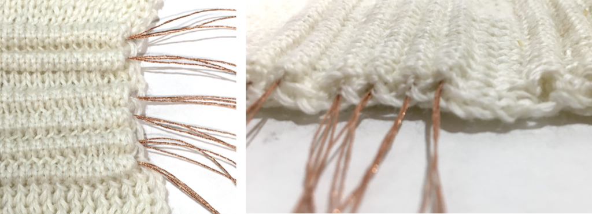

## HAID 2022 Interactive Textiles Workshop

The Interactive Textiles Workshop will take place as part of [HAID 2022](https://haid2022.qmul.ac.uk/registration/) at Queen Mary University of London, UK from 10:00-12:00 on 25 August, 2022.

Haptic interactions inherently need to consider the material that comes into contact with the user. These may be stiff materials such as plastics or metals, but it may also include deformable, soft materials like textiles. The emergence of electronic textiles (e-textiles) allows for sensing and actuating to be embedded into textile forms that can be integrated in clothing or act as a ‘skin’ for robots. Textiles however are not a homogeneous category of materials. Variations in construction and material composition can result in drastically different properties. 

This workshop will be a hands-on tutorial session covering the basics of textile design and e-textile sensor construction. Different kinds of conductive threads and fabrics will be presented and participants will get to make a series of e-textile sensors to take with them.

### Workshop Resources

[Instructions for making a pressure sensor](https://embelashed.org/paper/sensors/pressure.html) - Instructions are for paper, but general steps can be applied to textile.

[How to Get Want You Want](https://www.kobakant.at/DIY/) - The informal wikipedia of DIY e-textiles.

### Contact

If you have any questions, email the organisers Sophie Skach (s.skach@qmul.ac.uk) and Becky Stewart (r.stewart@imperial.ac.uk).
